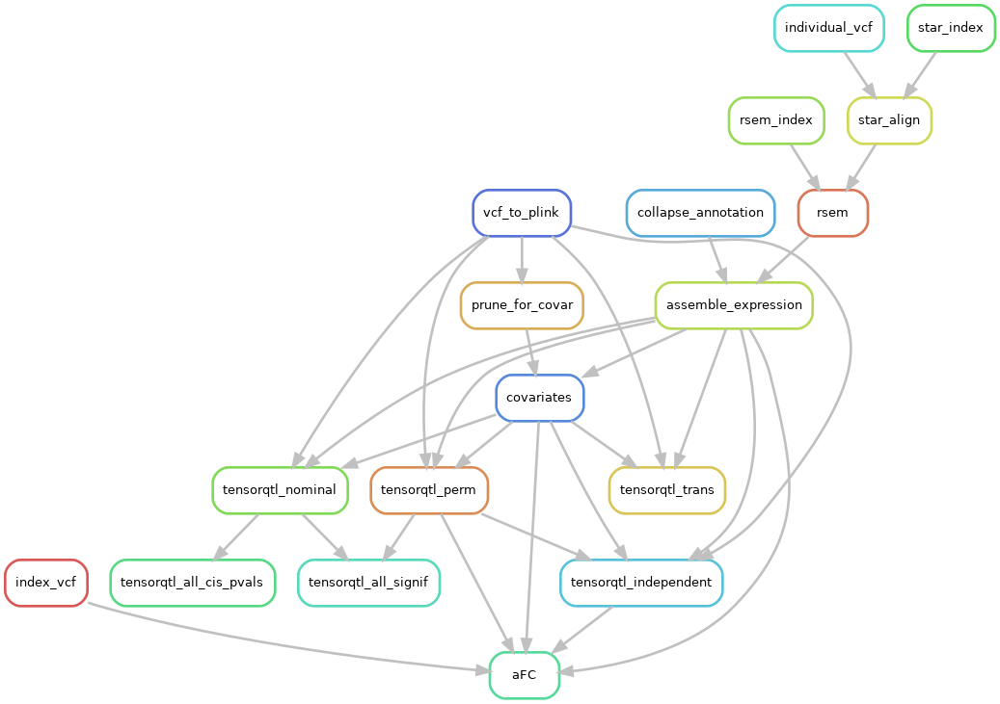
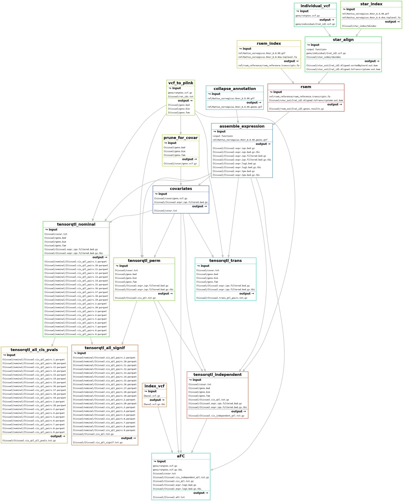

# RatGTEx Pipeline

This is the code used to process data for the [RatGTEx Portal](https://ratgtex.org). It is built on [Snakemake](https://snakemake.github.io/), a Python-based framework for reproducible data analysis. Since things might not work the first time with a new dataset, it makes it easy to process data iteratively. You can run part of the pipeline on a subset of the data, and then run it on the full dataset without regenerating existing files.

To add a new tissue to RatGTEx:
1. Make a directory within this one named as the tissue abbreviation.
2. Set up the software as described below.
3. Set up the raw data as described below.
4. Run snakemake as described below.

The main steps of the pipeline are:
1. Align RNA-Seq reads using [STAR](https://github.com/alexdobin/STAR).
2. Quantify gene expression using [RSEM](https://deweylab.github.io/RSEM/).
3. Map cis-eQTLs and trans-eQTLs using [tensorQTL](https://github.com/broadinstitute/tensorqtl) in various modes.
4. Calculate cis-eQTL effect size (allelic fold change) using [aFC.py](https://github.com/secastel/aFC).

Snakemake automatically links the pipeline together based on input and output files. Here is how all the steps link together:



Here's a more detailed version showing the inputs and outputs:



## Setup

### Conda environment

Install conda and [add the bioconda channel](https://bioconda.github.io/user/install.html#set-up-channels).

Install these packages using conda, e.g. `conda install snakemake`, or pip if indicated in parentheses:

- snakemake
- star
- rsem
- gtfparse
- tabix
- bioconductor-variantannotation
- plink2=2
- pandas
- bx-python

For QC:
- bcftools
- gatk

For tensorQTL:
- tensorqtl (pip)
- rpy2
- bioconductor-qvalue
- fastparquet

For aFC:
- pysam
- statsmodels
- scikits-bootstrap

(There's probably more that I've forgotten.)

### Other software

tensorQTL is available on pip, but install from GitHub for the latest version. I think this works:

```
cd tools
git clone git@github.com:broadinstitute/tensorqtl.git
pip install -e tensorqtl
```

To get `aFC.py`:

```
cd tools
git clone git@github.com:secastel/aFC.git
```

### Snakemake profile

When you run snakemake, you specify a profile that determines how steps get run. Here is the config file I use on a computing cluster with slurm scheduling:

`~/.config/snakemake/slurm/config.yaml`:

```yaml
use-conda: true
cluster: "sbatch -t {resources.walltime}:00:00 --mem={resources.mem_mb} -c {resources.cpus} {resources.partition} --mail-type=FAIL --mail-user=dmunro@scripps.edu"
default-resources: [walltime=1, mem_mb=4000, cpus=1, partition=""]
# partition should be e.g. "--partition=gpu"
```

Resources are specified for some of the snakemake rules, which are plugged into this command and automatically submitted as cluster jobs.

On TSCC, which uses TORQUE scheduling, the jobs run in the default conda environment rather than the one that is active when executing snakemake. So if you want to use an environment other than `base`, e.g. `ratgtex`, add `conda activate ratgtex` to the end of your `~/.bashrc` file. This is just a workaround since it affects which environment loads on login too, and must be modified if you want to run jobs for another project. Let me know if you find a way to either specify the environment in the Snakefile or snakemake command, or always run jobs using the active environment.

### Pan-tissue input files

I'll provide reference files too big for this repo in `tscc:/home/dmunro/ratgtex`, which you can copy or make symbolic links to.

#### `Rattus_norvegicus.Rnor_6.0.dna.toplevel.{dict,fa,fa.fai}`

Rat genome files.

#### `ref/Rattus_norvegicus.Rnor_6.0.99.gtf`

Gene annotations.

#### `geno/ratgtex.vcf.gz`

This is the merge of genotypes from all rats across tissues. This is done to unify the format of original genotypes, and because the portal expects a single set of SNPs, even if some tissues don't have genotypes for some SNPs. If this file doesn't include all the rats for a new tissue dataset, they will have to be added to it before running the pipeline. It is generated using `src/merge_VCF.sh`, so add code there to process and merge the new genotypes.

#### `geno/all_rats_exons.vcf.gz`

This contains the genotypes for exon regions from all 6553 HS rats the Palmer Lab has collected. It is used to try to find a match for any RNA-seq samples that fail the sample mixup QC step and don't match any of the tissue's original cohort genotypes.

### Dataset-specific input files

#### FASTQ files

The FASTQ files can be in any accessible location. Currently only single-read RNA-Seq is implemented, but paired-end will also be supported soon.

#### `{tissue}/fastq_map.txt`

A tab-delimited file with no header containing the paths to each FASTQ file and the rat IDs they correspond to. Or, for paired-end reads, each row contains the first FASTQ path, second FASTQ path, and rat ID per file pair.
- If multiple files map to the same ID, i.e. the ID appears in multiple rows, reads from those files will be aligned into one BAM file.
- You can use the `fastq_path` parameter in `config.yaml` to specify the encompassing directory as an absolute or relative path. That way `fastq_map.txt` can just contain the remainder of the path to each file (including any subdirectories as necessary).
- Any listed files whose rat IDs are not in `{tissue}/rat_ids.txt` will be ignored.

#### `{tissue}/rat_ids.txt`

A file listing the rat IDs for the dataset, one per line. This list determines which samples are included in the processing.

## Running

Create or edit config.yaml in this directory. Unlike the Snakemake config file, which specifies how jobs are run, this one contains parameters for the tissue/dataset such as read length and directory where FASTQ files can be found. I recommend having a config file for each tissue, e.g. `Eye.yaml`, and copy the one you want to use to `config.yaml`.

### QC

#### Pre-run checks

Before running Snakemake, run `python3 src/qc_init_check.py {tissuename}`, which checks the input data and config for issues.

#### Sample mixup checks

The way to do sample mixup testing is to generate the mixup checking outputs using Snakemake, which will generate the BAM files as dependencies if needed. Examine the outputs to identify samples that need to be relabeled (e.g. if two labels get swapped) or removed.

- To relabel a sample, edit the ID in the 2nd column of `fastq_map.txt` for all of its FASTQ files so that its BAM file gets labeled correctly. You'll then need to regenerate the BAM file since it will now use the correct VCF individual as input to STAR.
- To remove a sample, remove its ID from `rat_ids.txt` and delete its BAM and any other generated files.

Before removing samples, run the second stage of sample mixup checking, which tests the RNA-seq samples that still don't have matches against 6000+ rat genotypes to see if a match can be found. To do this, list the mismatched samples in `{tissue}/qc/samples_without_matches.txt`, along with an OK sample as a positive control. Then generate `{tissue}/qc/all_rats_summary.tsv` and use any additional matches found. This will probably require adding the new matching genotypes to `ratgtex.vcf.gz` (see `src/merge_VCF.sh`).

### Continue

After these corrections, continue with the pipeline.

You may want to run a subset of the heavy raw data processing steps first, then move on once those are done. E.g. add the first 10 BAM files to the first rule (called 'all') in `Snakefile` and generate them:

`snakemake --profile slurm -j10`

Use the `-n` dry run tag to make sure things seem to be set up correctly before running.

## Help

There are likely a number of issues remaining with this pipeline, so email me or file an issue on this GitHub repository if anything isn't working, and I'll be happy to fix it.
