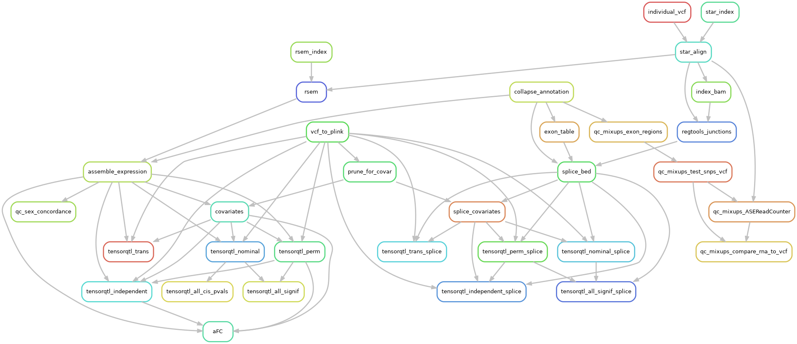
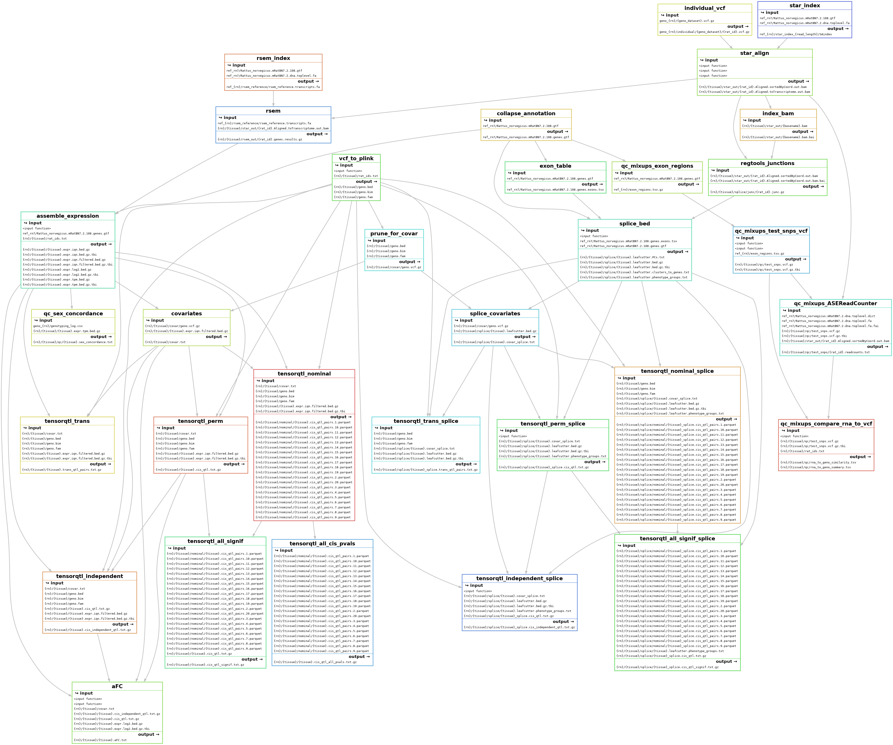

# RatGTEx Pipeline

This is the code used to process data for the [RatGTEx Portal](https://ratgtex.org). It is built on [Snakemake](https://snakemake.github.io/), a Python-based framework for reproducible data analysis. Since things might not work the first time with a new dataset, it makes it easy to process data iteratively. You can run part of the pipeline on a subset of the data, and then run it on the full dataset without regenerating existing files.

To add a new tissue to RatGTEx:
1. Make a directory within this one named as the tissue abbreviation.
2. Set up the software as described below.
3. Set up the raw data as described below.
4. Run snakemake as described below.

The main steps of the pipeline are:
1. Align RNA-Seq reads using [STAR](https://github.com/alexdobin/STAR).
2. Checking for and fixing sample mixups.
3. Quantify gene expression using [RSEM](https://deweylab.github.io/RSEM/).
4. Map cis-eQTLs and trans-eQTLs using [tensorQTL](https://github.com/broadinstitute/tensorqtl) in various modes.
5. Calculate cis-eQTL effect size (allelic fold change) using [aFC.py](https://github.com/secastel/aFC).
6. Map cis-sQTLs and trans-sQTLs using [regtools](https://regtools.readthedocs.io/en/latest/), [leafCutter](http://davidaknowles.github.io/leafcutter/), and tensorQTL.

Snakemake automatically links the pipeline together based on input and output files. Here is how all the steps link together:



Here's a more detailed version showing the inputs and outputs:



## Setup

### Conda environment

Install a conda-like package manager (I recomment [miniforge](https://github.com/conda-forge/miniforge)) and add the bioconda channel.

Create the ratgtex environment:

```shell
conda env create -n ratgtex --file environment.yml
conda activate ratgtex
```

### Other software

To get `aFC.py`:

```
cd tools
git clone git@github.com:secastel/aFC.git
```

### Snakemake profile

When you run snakemake, you specify a profile that determines how steps get run. Here is the config file I use on a computing cluster with slurm scheduling:

`~/.config/snakemake/slurm/config.yaml`:

```yaml
executor: slurm
default-resources:
  runtime: "4h"
  mem_mb: 8000
  slurm_partition: "our-cpu-partition"
  slurm_account: "our-cpu-account"
set-resources:
  tensorqtl_cis:
    slurm_partition: "our-gpu-partition"
    slurm_account: "our-gpu-account"
    slurm_extra: "'--gres=gpu:1'"
  tensorqtl_cis_independent:
    slurm_partition: "our-gpu-partition"
    slurm_account: "our-gpu-account"
    slurm_extra: "'--gres=gpu:1'"
  tensorqtl_nominal:
    slurm_partition: "our-gpu-partition"
    slurm_account: "our-gpu-account"
    slurm_extra: "'--gres=gpu:1'"
  tensorqtl_trans:
    slurm_partition: "our-gpu-partition"
    slurm_account: "our-gpu-account"
    slurm_extra: "'--gres=gpu:1'"
use-conda: true
latency-wait: 60
```

This uses snakemake v8 or higher and the `snakemake-executor-plugin-slurm` plugin. The `tensorqtl` steps should be run on GPU for reasonable runtime, so they are specified by name here to override the default resources. Adjust as needed for your cluster. Additional resources are specified within some of the snakemake rules, which are passed to slurm when those jobs are submitted. Alternatively, you can run snakemake on an interactive node.

#### `config.yaml`

This configuration file contains parameters about the datasets and reference data and is used by snakemake. Parameters for each tissue are grouped under tissue names, e.g.:

```yaml
version: "v3"
ref_genome: "ref/GCF_015227675.2_mRatBN7.2_genomic.chr.fa"
ref_anno: "ref/GCF_015227675.2_mRatBN7.2_genomic.chr.gtf"

tissues:
  # IL, LHb, NAcc1, OFC, and PL1 datsets
  IL:
    read_length: 100
    fastq_path: "fastq/IL_LHb_NAcc_OFC_PL"
    paired_end: false
    geno_dataset: "IL_LHb_NAcc_OFC_PL"
  LHb:
    read_length: 100
    fastq_path: "fastq/IL_LHb_NAcc_OFC_PL"
    paired_end: false
    geno_dataset: "IL_LHb_NAcc_OFC_PL"
...
```

Some of these are inherent to the data, while others, e.g. `fastq_path`, may need to be edited to point to the correct location.

### Dataset-specific input files

#### FASTQ files

The RNA-seq FASTQ files can be single-read or paired-end. There can be more than one file or file pair per sample, and all will be used.

#### `{version}/{tissue}/fastq_map.txt`

A tab-delimited file with no header containing the paths to each FASTQ file and the rat IDs they correspond to. Or, for paired-end reads, each row contains the first FASTQ path, second FASTQ path, and rat ID per file pair.
- If multiple files map to the same ID, i.e. the ID appears in multiple rows, reads from those files will be aligned into one BAM file.
- You can use the `fastq_path` parameter in `config.yaml` to specify the encompassing directory as an absolute or relative path. That way `fastq_map.txt` can just contain the remainder of the path to each file (including any subdirectories as necessary).
- Any listed files whose rat IDs are not in `{version}/{tissue}/rat_ids.txt` will be ignored.

#### `{version}/{tissue}/rat_ids.txt`

A file listing the rat IDs for the dataset, one per line. This list determines which samples are included in the processing.

#### `geno/{dataset}.vcf.gz`

A VCF file containing the genotypes for one or more tissues. If multiple tissues came from the same project and have overlapping sets of individuals, they use the same VCF file. These are created using `scripts/setup/genotypes_{version}.sh`, which ensures that REF alleles match the reference genome and that the VCFs are otherwise compatible with the pipeline. Specify the dataset name in the pipeline config file as described below.

## Running

Edit `config.yaml` in this directory so that the tissue(s) you want to process are present in the `tissues` section with correct parameters, and are listed in the `run` section. Unlike the Snakemake config file, which specifies how jobs are run, this one contains parameters for the tissues/datasets such as read length and directory where FASTQ files can be found.

### QC

#### Pre-run checks

Before running Snakemake, run `python3 scripts/setup/init_check.py {version} {tissue}`, which checks the input data and config for issues.

#### Sample mixup checks

The way to do sample mixup testing is to generate the mixup checking outputs using Snakemake, which will generate the BAM files as dependencies if needed. Examine the outputs to identify samples that need to be relabeled (e.g. if two labels get swapped) or removed.

- To relabel a sample, edit the ID in the 2nd column of `fastq_map.txt` for all of its FASTQ files so that its BAM file gets labeled correctly. You'll then need to regenerate the BAM file since it will now use the correct VCF individual as input to STAR.
- To remove a sample, remove its ID from `rat_ids.txt` and delete its BAM and any other generated files.

Before removing samples, run the second stage of sample mixup checking, which tests the RNA-seq samples that still don't have matches against 6000+ rat genotypes to see if a match can be found. To do this, list the mismatched samples in `{version}/{tissue}/qc/samples_without_matches.txt`, along with an OK sample as a positive control (if that sample is included in the all-rat VCF). Then generate `{version}/{tissue}/qc/all_rats_summary.tsv` and use any additional matches found. This will probably require adding the new matching genotypes to the VCF file (see `scripts/setup/genotypes_{version}.sh`).

### Continue

After these corrections, continue with the pipeline.

You may want to run a subset of the heavy raw data processing steps first, then move on once those are done. E.g. add the first 10 BAM files to the first rule (called 'all') in `Snakefile` and generate them:

`snakemake --profile slurm -j10`

Use the `-n` dry run tag to make sure things seem to be set up correctly before running.

### Merging same-tissue datasets

Sets of samples from the same tissue, collected by different studies, can be run individually and then run as a merged dataset. These merges (e.g. NAcc1 + NAcc2 + NAcc3 = NAcc) are specified in the config. Keep the merged tissue names commented out in the `run` list at first to run the individual datasets, at least until RSEM and regtools junctions are run on all their samples. Run `scripts/setup/setup_merged_tissues.sh` to set up the merged directories, which involves symlinking to all the RSEM and regtools outputs, and merging the rat ID lists. Then, uncomment the merged tissue names in the `run` list and run them.

## Help

There are likely a number of issues remaining with this pipeline, so email me or file an issue on this GitHub repository if anything isn't working, and I'll be happy to fix it.
